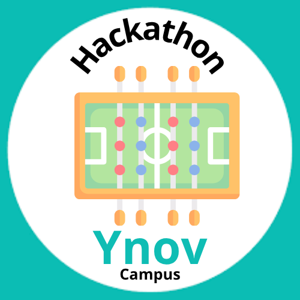
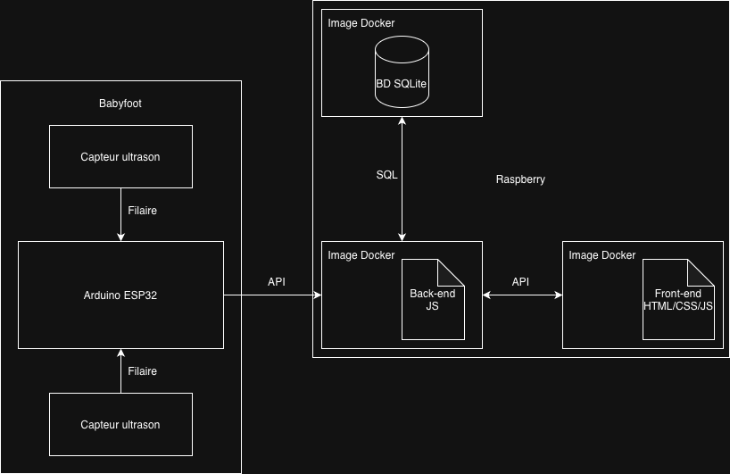

<table width="100%" border="0" cellspacing="0" cellpadding="0">
<tr>
<td align="left"><h1>Hackathon - Ynov Toulouse 2025</h1></td>
<td align="right"></td>
</tr>
</table>

> Ce repository contient les ressources ainsi que le code source développé lors du hackathon Ynov Toulouse 2025.

Cette template de README est un guide pour vous aider à structurer votre rendu de projet. N'hésitez pas à l'adapter ou surtout à le compléter avec des sections supplémentaires si nécessaire.

## Contexte

Et si on réinventait l’expérience babyfoot à Ynov ? L’objectif de ce hackathon est de moderniser et digitaliser l’usage des babyfoots présents dans le Souk pour créer un service _next-gen_, pensé pour près de 1000 étudiants !

Que ce soit via des gadgets connectés, un système de réservation intelligent, des statistiques en temps réel ou des fonctionnalités robustes pour une utilisation massive, nous cherchons des solutions innovantes qui allient créativité et technologie.

Toutes les filières sont invitées à contribuer : Dev, Data, Infra, IoT, Systèmes embarqués… chaque idée compte pour rendre le babyfoot plus fun, plus pratique et plus connecté.

Votre mission : transformer le babyfoot classique en expérience high-tech pour Ynov !

Bienvenue dans le Hackathon Ynov Toulouse 2025 !

> Retrouvez vos guidelines techniques dans le fichier [SPECIFICATIONS.md](./SPECIFICATIONS.md).

> P.S C'est un projet de groupe, pas autant de sous-projets que de filières dans votre équipe. Travaillez ensemble pour un seul et même projet au nom de votre équipe toute entière. Les guidelines sont là pour vous aider, pas pour vous diviser. Profitez de ce moment pour apprendre à travailler ensemble, partager vos compétences, et créer quelque chose d'unique.

## Equipe

- Dev' FullStack 1 : Breton Swan
- Dev' FullStack 2 : Douville Léo
- Dev' FullStack 3 : Mamie Melissa
- Cloud & Infrastructure 1 : ARROUD Rayan
- Cloud & Infrastructure 2 : MOUMINE Wassim
- IA & Data 1 : FOURNET Charly
- IA & Data 2 : RAVEL Arthur
- IoT/Mobile / Systèmes Embarqués 1 : Bertaud Nathan
- IoT/Mobile / Systèmes Embarqués 2 : Reungoat Nathan

> Préciser qui est le porte parole de l'équipe, c'est lui qui répondra aux questions si nécessaire.

- Reungoat Nathan

## Table des matières

- [Contexte](#contexte)
- [Equipe](#equipe)
- [Contenu du projet](#contenu-du-projet)
- [Technologies utilisées](#technologies-utilisées)
- [Architecture](#architecture)
- [Guide de déploiement](#guide-de-déploiement)
- [Etat des lieux](#etat-des-lieux)

## Contenu du projet

> Décrivez brièvement le projet, son objectif. Utilisez une vue business pour décrire ce que votre produit/service apporte à vos utilisateurs.

## Technologies utilisées

> - DATA : SQL, Python, DAX (PowerBI)
> - IOT : C++, platformIO
> - Frontend : HTML, CSS, js
> - Backend : express.js, js

## Architecture

> ## 1. Babyfoot (Partie matérielle)
>
> Le babyfoot intègre deux **capteurs ultrason** connectés par fil à une **carte Arduino ESP32**.  
> Les capteurs détectent le passage de la balle pour identifier les buts.  
> L’ESP32 lit ces données et envoie une requête **API HTTP** vers le serveur hébergé sur le **Raspberry Pi**.
>
> ## 2. Raspberry Pi (Partie serveur)
>
> Le **Raspberry Pi** exécute plusieurs **conteneurs Docker** :
> - **Back-end (Node.js)** : reçoit les données de l’ESP32, les traite et les enregistre.  
> - **Base de données (SQLite)** : stocke les informations de jeu (buts, temps, scores).  
> - **Front-end (HTML/CSS/JavaScript)** : affiche les données et interagit avec le back-end via une **API REST**.  
>
> Le back-end communique avec la base SQLite via des requêtes **SQL**,  
> et utilise une **API REST** pour communiquer avec le front-end.
>
> ## 3. Interface Web (Front-end)
>
> Le **front-end**, exécuté dans un **conteneur Docker**, est développé en **HTML, CSS et JavaScript**.  
> Il interroge régulièrement l’API du back-end pour récupérer les dernières données (scores, statistiques, etc.).  
> Les informations sont ensuite affichées sur une interface web accessible depuis un navigateur.
>
> ## 4. Flux global de données
>
> 1. Les **capteurs ultrason** détectent le passage de la balle.  
> 2. L’**ESP32** envoie une requête **API HTTP** au **back-end** du Raspberry Pi.  
> 3. Le **back-end** enregistre l’événement dans la **base SQLite**.  
> 4. Le **front-end** (dans son conteneur Docker) interroge l’API du back-end.  
> 5. Les informations (scores, statistiques, etc.) sont affichées en temps réel sur l’interface web.

## Guide de déploiement

> Expliquez comment déployer votre application **EN MOINS DE LIGNES DE COMMANDE POSSIBLES**. Docker, Ansible, Terraform, Scripts Shell... Le but est de pouvoir déployer votre application en une seule commande ou presque.

Exemple de lancement en **une seule commande**:

[Références Proxmox HelperScripts](https://github.com/community-scripts/ProxmoxVE/tree/main/install)

> /!\ IMPORTANT /!\ : Votre projet sera déployé sur une machine **LINUX** (Debian/Ubuntu), avec 4Go de RAM et 2 CPU (x86_64). Assurez-vous que votre application peut fonctionner dans ces conditions. Il n'y aura pas de "Ca marche sur mon Mac." ou encore "Si on alligne les astres sur Windows XP ça passe.".

## Etat des lieux

> Section d'honnêteté, décrivez ce qui n'a pas été fait, ce qui aurait pu être amélioré, les limitations de votre solution actuelle. Montrez que vous avez une vision critique de votre travail, de ce qui a été accompli durant ces deux demi-journées.

Le projet est dans un bon état d'avancement. Il manque néanmoins une liaison entre le backend et les capteurs, donc les capteurs détectent la balle mais ne remontent pas l'information. Il y a également differentes parties du front qui ne sont pas assemblé ensemble.
