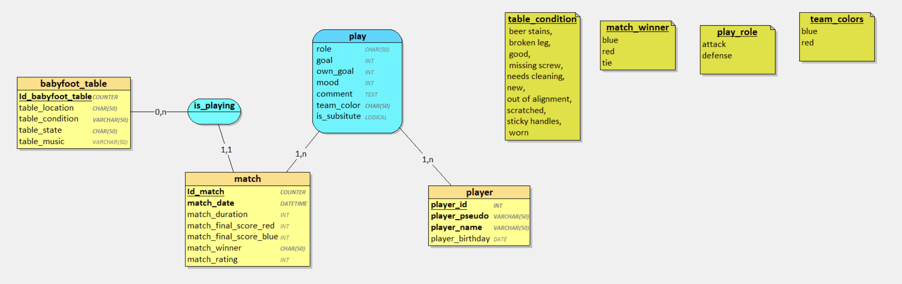

# Documentation de la base de données "babyfoot"

## Table : `babyfoot_table`

Gère l'inventaire des tables de baby-foot physiques.

| Champ                 | Type    | Contraintes                                                                                                                                              | Description                             |
| --------------------- | ------- | -------------------------------------------------------------------------------------------------------------------------------------------------------- | --------------------------------------- |
| `Id_babyfoot_table` | INTEGER | PRIMARY KEY AUTOINCREMENT                                                                                                                                | Identifiant unique de la table          |
| `table_location`    | TEXT    | NOT NULL                                                                                                                                                 | Emplacement/lieu où se trouve la table |
| `table_condition`   | TEXT    | CHECK ('beer stains', 'broken leg', 'good', 'missing screw', 'needs cleaning', 'new', 'out of alignment', 'scratched', 'sticky handles', 'worn') OR NULL | État détaillé de la table            |
| `table_state`       | TEXT    | CHECK ('ok', 'busy', 'down') OR NULL                                                                                                                     | État opérationnel simplifié          |
| `table_music`       | TEXT    | -                                                                                                                                                        | Musique associée                       |

---

## Table : `match_`

Enregistre les matchs joués.

| Champ                      | Type     | Contraintes                             | Description                               |
| -------------------------- | -------- | --------------------------------------- | ----------------------------------------- |
| `Id_match`               | INTEGER  | PRIMARY KEY AUTOINCREMENT               | Identifiant unique du match               |
| `match_date`             | DATETIME | NOT NULL, UNIQUE                        | Date et heure du match                    |
| `match_duration`         | INTEGER  | -                                       | Durée du match (en secondes)             |
| `match_final_score_red`  | INTEGER  | -                                       | Score final de l'équipe rouge            |
| `match_final_score_blue` | INTEGER  | -                                       | Score final de l'équipe bleue            |
| `match_winner`           | TEXT     | CHECK ('red', 'blue', 'tie')            | Équipe gagnante ou match nul             |
| `match_rating`           | INTEGER  | CHECK BETWEEN 1 AND 5                   | Note du match (1 à 5)                    |
| `Id_babyfoot_table`      | INTEGER  | NOT NULL, FOREIGN KEY → babyfoot_table | Table sur laquelle le match a été joué |

---

## Table : `player`

Catalogue des joueurs.

| Champ               | Type    | Contraintes      | Description                  |
| ------------------- | ------- | ---------------- | ---------------------------- |
| `player_id`       | INTEGER | PRIMARY KEY      | Identifiant unique du joueur |
| `player_pseudo`   | TEXT    | NOT NULL, UNIQUE | Pseudo du joueur             |
| `player_name`     | TEXT    | NOT NULL, UNIQUE | Nom complet du joueur        |
| `player_password` | TEXT    | NOT NULL, UNIQUE | Mot de passe                 |
| `player_birthday` | DATE    | -                | Date de naissance du joueur  |

---

## Table : `play`

Table d'association entre matchs et joueurs (statistiques de participation).

| Champ             | Type    | Contraintes                                    | Description                                |
| ----------------- | ------- | ---------------------------------------------- | ------------------------------------------ |
| `Id_match`      | INTEGER | PRIMARY KEY (composite), FOREIGN KEY → match_ | Référence au match                       |
| `player_id`     | INTEGER | PRIMARY KEY (composite), FOREIGN KEY → player | Référence au joueur                      |
| `role`          | TEXT    | CHECK ('attack', 'defense')                    | Rôle du joueur pendant le match           |
| `goal`          | INTEGER | -                                              | Nombre de buts marqués                    |
| `own_goal`      | INTEGER | -                                              | Nombre de but contre son camps             |
| `mood`          | INTEGER | -                                              | Indicateur d'humeur/score subjectif        |
| `comment`       | TEXT    | -                                              | Commentaire libre sur la performance       |
| `team_color`    | TEXT    | CHECK ('red', 'blue')                          | Couleur de l'équipe                       |
| `is_substitute` | BOOLEAN | -                                              | Indique si le joueur est remplaçant (0/1) |

## MCD

*Figure : MCD du schéma de la base "babyfoot"*
