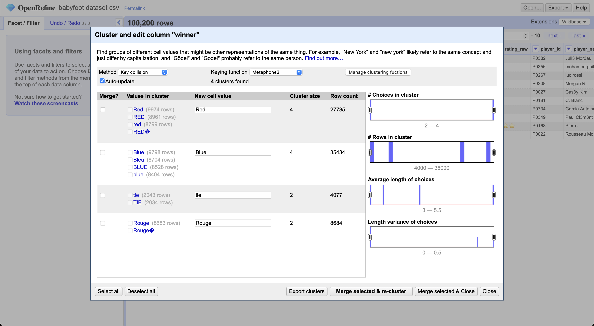
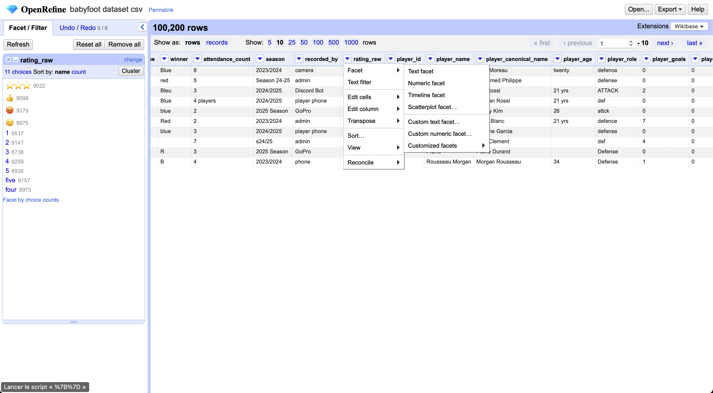
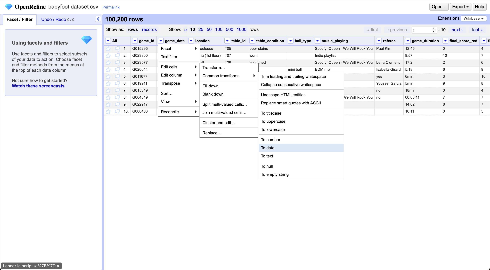

# Hackathon - Ynov Toulouse 2025 : Babyfoot du futur - IA & Data

## Equipe

- IA & Data 1 : FOURNET Charly
- IA & Data 2 : RAVEL Arthur

Et si on réinventait l’expérience babyfoot à Ynov ? L’objectif de ce hackathon est de moderniser et digitaliser l’usage des babyfoots présents dans le Souk pour créer un service _next-gen_, pensé pour près de 1000 étudiants !

Que ce soit via des gadgets connectés, un système de réservation intelligent, des statistiques en temps réel ou des fonctionnalités robustes pour une utilisation massive, nous cherchons des solutions innovantes qui allient créativité et technologie.

Toutes les filières sont invitées à contribuer : Dev, Data, Infra, IoT, Systèmes embarqués… chaque idée compte pour rendre le babyfoot plus fun, plus pratique et plus connecté.

Votre mission : transformer le babyfoot classique en expérience high-tech pour Ynov !

---

> Ce fichier contient les informations spécifiques à l'IA/Data de votre projet. Il suffit d'en remplir une seule fois, même si vous êtes plusieurs IA/Data dans l'équipe.

# Requis

Ce README contient les requis fonctionnels de la partie IA Data de votre projet. Il doit compléter le README principal à la racine du projet, et servira la partie de votre note propre à votre spécialité.

Basez-vous sur les spécifications dans [SPECIFICATIONS.md](../SPECIFICATIONS.md) pour remplir ce document.

Décrivez ici les actions que vous avez menées, votre démarche, les choix techniques que vous avez faits, les difficultés rencontrées, etc. Précisez également dans quelle mesure vous avez pu collaborer avec les autres spécialités.

Autrement, il n'y a pas de format imposé, mais essayez de rester clair et concis, je ne vous demande pas de rédiger un roman, passez à l'essentiel, et épargnez-moi de longues pages générées par IA (malusée).

En conclusion, cela doit résumer votre travail en tant qu'expert.e IA Data, et vous permettre de garder un trace écrite de votre contribution au projet.

Merci de votre participation, et bon courage pour la suite du hackathon !

# Travaux effectués

## Traitement des données

Le traitement des données a été effectué initialement avec OpenRefine. Nous avons utilisé la fonction de clustering pour identifier les textes semblables et fusionner les variantes orthographiques (ex. "bleu", "blu", "blue"), ce qui a permis de normaliser les valeurs. Grâce à OpenRefine, nous avons aussi analysé l'ensemble des textes d'une colonne et effectué des remplacements massifs (ex. convertir des évaluations représentées par 3 emojis étoile en la valeur numérique 3, visualisation rapide des problèmes d'encodage sur les colonnes avec un nombre défini de string précis). Enfin, nous avons uniformisé rapidement les formats de date (parsing et mise au même format ISO).

En complément, un nettoyage approfondi a été réalisé en Python avec Pandas.
Ce processus a permis de traiter les incohérences laissées après OpenRefine et d’automatiser plusieurs étapes clés :

- Suppression des doublons et normalisation des colonnes de durée (ex. "2 min 30" → 150 secondes).

- Parsing automatique des scores pour corriger les formats irréguliers (ex. "5–10" ou "5 - 10"), avec conversion en valeurs entières et ajout d’une colonne winner calculée à partir des scores.

- Uniformisation des dates, incluant la détection et l’exclusion des dates non plausibles (avant 2010 ou dans le futur), puis l’extraction de l’année, du mois et du jour pour les analyses temporelles.

 Le notebook de nettoyage se trouve ici : `rendus/data/data.ipynb`

Standardisation des champs logiques, comme la conversion de is_substitute en booléen (True/False) afin d’unifier les types.
> ### Clustering
> 
>
> ### Analyse des textes et transformation
> 
>
> ### Uniformisation des dates
> 

## Analyse
Cette partie concernait principalement l’analyse et la remise en forme de l’ancienne data afin de la rendre exploitable dans un environnement unifié.
L’objectif était de comprendre les incohérences présentes dans les anciens fichiers (formats de scores variés, valeurs manquantes, dates incohérentes, doublons, etc.) et d’assurer leur compatibilité avec le nouveau système de collecte.

Pour cela, nous avons créé une base SQLite permissive, pensée pour accepter ces données historiques sans perte d’information.
Une image Docker a été mise en place pour tester l’envoi et la persistance de ces anciennes données, tout en validant la communication entre la base et les outils d’analyse.
Cette étape servait avant tout de proof of concept pour vérifier la faisabilité du pipeline complet et la stabilité du stockage.

Le code lié à l’insertion et au déploiement Docker est disponible dans le dossier : `rendus/data/babyfoot_docker`

## Mise en place de la BD

En parallèle, nous avons mis en place une base de données robuste. Toutes les spécifications et la documentation se trouvent dans le fichier [db_sql/documentation.md](db_sql/documentation.md).
Niveau technologie nous nous sommes tournés aussi sur SQLite pour la légereté du SGBD qui tournera sur le raspberry avec les spécifications données par l'équipe infra et la connaissance SQL du groupe entier, surtout de la part des dévs.

## Power BI

Lors de la connexion à Power BI, nous avons rencontré un problème d’incompatibilité directe avec SQLite, car Power BI ne prend pas en charge ce moteur nativement.
La solution a été d’installer manuellement le driver ODBC SQLite, permettant ainsi de créer une passerelle entre Power BI et la base locale.
Grâce à cette configuration, nous avons pu établir la connexion, visualiser les résultats issus de l’ancienne data, et vérifier la cohérence des transformations via les premiers rapports de performance du babyfoot.

> ### Database

> ### Dashboard User

> ### Dashboard Table_Babyfoot

## ChatBot IA

Un chatbot intelligent nommé Bob le Foot a été développé en Python.
Son rôle est d’apporter une touche interactive et ludique à l’expérience babyfoot, en servant d’arbitre virtuel capable de répondre aux joueurs sur les règles, les fautes ou le déroulement des matchs.

Le modèle s’appuie sur l’API Gemini de Google, configurée à partir d’un fichier JSON contenant plusieurs pré-prompts selon le rôle à adopter.
L’agent a été testé localement dans un notebook Jupyter, puis partagé à l’équipe via Discord, accompagné du code, de la clé API et du fichier preprompt.json.
Cette intégration visait à permettre aux autres membres (développeurs et front-end) d’intégrer Bob Foot dans l’interface du projet, pour enrichir l’interactivité et la dimension IA du babyfoot connecté.

## L'équipe DATA au sein de l'équipe

Pour finir, nous avons pu être les pierres angulaires du groupe. Étant responsables de la partie data, tous les groupes devaient savoir quelles données étaient communiquées et de quelle manière. Grâce à notre expérience professionnelle, nous avons également animé des points réguliers durant ces dernières 48 heures afin de cadrer l’avancée du projet. Enfin, le fait d’être deux nous a permis de nous répartir les tâches : l’un de nous pouvait suivre de près un groupe en particulier afin de les aider et de répondre à leurs éventuelles questionsce qui permettait au second d’avancer simultanément sur les livrables prévus et les aspects techniques liés à la data.
